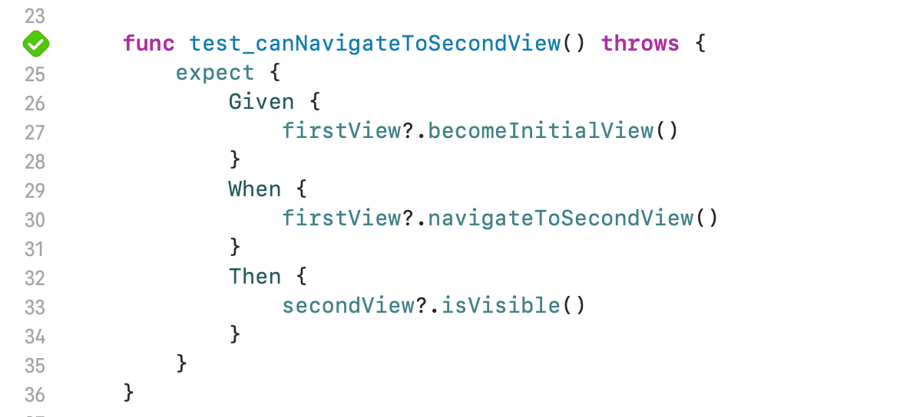
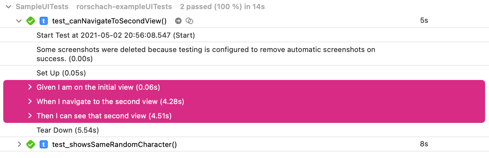

# rorschach Concepts

This repository hosts an example app to highlight the concepts of the [rorschach Swift Package](https://github.com/q231950/rorschach).

The following test can be found in [UITests.swift](https://github.com/q231950/rorschach-concepts/blob/main/rorschach-exampleUITests/SampleUITests.swift#L24-L36):

Output of the test in the Xcode Report navigator.

---

The text and the image visible in the second view of the application originate from [projekt-gutenberg.org](https://www.projekt-gutenberg.org/hauff/maerchen/chap001.html).